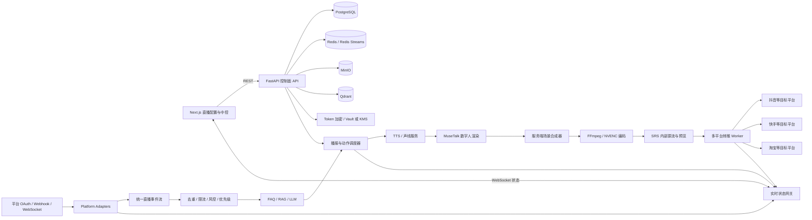

# AvatarLive 数字人直播商用化架构与分步实施路线

> 编写日期：2026-08-31（Asia/Shanghai）
>
> 目标：把当前 `/live` 的直播配置演示页升级为可保存、可自动播报、可真实推流、可接收平台互动并可长期运行的数字人直播系统。
>
> 边界：本文只给出架构、技术选型、文件改造范围、平台授权流程、实施顺序和验收标准。用户确认前不修改业务代码、不部署服务、不申请或绑定外部平台账号。

## 1. 结论先行

当前项目已经有可复用的数字人实时播报基础，但还没有形成商用直播闭环：

```text
当前可用主链路

浏览器输入单条话术
-> MuseTalk server_total
-> TTS + 口型/动作底板
-> 浏览器 Canvas 预览
```

要升级成商用直播产品，需要新增四个相互独立但协同工作的平面：

```text
控制面：直播间、商品、脚本、场景、声音、平台账号、权限和审计
事件面：弹幕、点赞、关注、礼物、订单、AI 问答和播报优先级
媒体面：数字人帧、字幕、商品卡、图片、视频、BGM、编码和推流
数据面：PostgreSQL、Redis、MinIO、Qdrant、指标和直播复盘
```

推荐按以下原则实施：

1. 先跑通“持久化配置 -> 自动播报 -> 最终画面合成 -> 单路真实 RTMP”，再做多平台。
2. 平台资质和 API 权限申请从第 0 阶段就开始，因为审批可能比开发周期更长。
3. RTMP 推流权限、账号 OAuth、直播互动权限、商品/订单权限分开管理，不能混为一个“已授权”状态。
4. 平台权限未获批时，只允许使用用户手工提供的合法 RTMP 地址，不能用非官方抓包或弹幕采集绕过授权。
5. 浏览器只承担配置和预览，最终直播画面必须在服务端合成、编码和推流。
6. 先复用现有 PostgreSQL、Redis、Qdrant、MinIO、SRS 和 MuseTalk，不在 MVP 阶段引入 Kafka、Kubernetes 或复杂微服务体系。

## 2. 当前项目基础与必须调整的边界

### 2.1 可以继续复用的能力

- Next.js `/live` 直播配置界面和当前模板、图层编辑交互。
- `MuseTalkTotalStream` 的文本播报、问答、取消、音画时间轴和浏览器预览能力。
- `apps/musetalk/` 中的人物目录、动作运行时、WebRTC/音频流处理能力。
- FastAPI 中已有的 Session、LLM、TTS 和渲染器抽象。
- Docker Compose 中已有的 PostgreSQL、Redis、Qdrant、MinIO 和 SRS。
- LiteLLM 统一模型入口以及现有中文 TTS/声线资产。
- `docs/2d-video-avatar-live-action-industry-research.md` 中确定的“2D 动作底板 + 语义动作调度”路线。

### 2.2 当前真实边界

| 位置 | 当前状态 | 后续处理 |
| --- | --- | --- |
| `src/components/live-studio.tsx` | 单文件同时管理页面、商品、脚本、图层、声音和开播演示状态 | 拆分组件、领域状态和 API hooks |
| `src/lib/musetalk-total-stream.ts` | 适合浏览器单次播报/问答预览 | 保留为低延迟预览客户端，不承担生产推流总控 |
| `apps/api/app/services/live/sessions.py` | 进程内字典，服务重启后数据丢失 | 改为 PostgreSQL 持久化 + Redis 运行状态 |
| `apps/api/app/api/v1/live.py` | 只有创建 Session、播报和回答 | 扩展直播间配置、预检、开停播、控制命令和状态订阅 |
| `infra/srs/conf/srs.conf` | 可接收 RTMP 并提供 FLV/HLS/WebRTC | 接入最终合成流；增加鉴权、回调、录制和状态采集 |
| `infra/docker-compose.yml` | 数据服务和 SRS 已有骨架 | 增加编排 worker、媒体 worker、平台 adapter worker 和监控组件 |
| `AvatarLive-backend/server_total` | 位于当前仓库外部，负责完整 MuseTalk/TTS/LLM 流 | 需要同步修改协议，使其可输出服务端媒体或接入媒体 worker |
| `/app/*` | 父布局当前会重定向到首页，内部模块还是原型占位 | 与 `/live` 保持隔离；本轮不合并实时互动和数字人形象配置 |

### 2.3 不建议延续的实现方式

- 不把 `setState` 后显示成功提示当成“保存、开播或授权成功”。
- 不在浏览器 DOM 中叠加画面后宣称已经合成推流。
- 不为每个平台复制一套直播业务逻辑；平台差异必须放进 Adapter。
- 不把弹幕、礼物、订单事件直接送给 LLM；必须先鉴权、验签、去重、限流和风控。
- 不把 RTMP 推流密钥、OAuth token、AppSecret 放在前端、日志或普通明文字段中。
- 不在直播进行中直接修改人物、编码等不可热更新参数；应通过版本化配置在下一次开播生效。

## 3. 推荐总体架构



### 3.1 控制面

负责低频、强一致的业务配置：

- 直播间 CRUD、复制、版本和发布。
- 商品、脚本、问答、场景、人物、声音和素材绑定。
- 平台账号授权、权限范围、推流目标和密钥生命周期。
- 开播前检查、开播、停播、人工接管和审计。
- 用户、租户、角色和操作权限。

控制面使用 FastAPI + PostgreSQL，不把正式配置只放在 Redis 或浏览器中。

### 3.2 事件面

负责实时、高频、可丢弃或可重放的事件：

- 评论、提问、点赞、关注、礼物、分享、商品点击和订单线索。
- 播报开始、结束、被打断、失败和恢复。
- 平台连接状态、推流状态和质量告警。

MVP 使用 Redis Streams。每个事件必须有 `tenant_id`、`platform`、`room_id`、`event_id`、`type`、`timestamp` 和幂等键。

### 3.3 媒体面

负责服务端最终画面，不再依赖浏览器 DOM：

```text
数字人视频帧 + PCM 音频
+ 背景/模板
+ 商品图/商品卡/价格
+ 字幕/角标/AI 标识
+ 视频素材
+ BGM/音效
-> 服务端合成
-> H.264 + AAC
-> SRS 内部源流
-> FFmpeg 按平台转推
```

MVP 推荐先用 Python/OpenCV/Pillow 或 PyAV 完成动态画面合成，再把原始视频和 PCM 交给 FFmpeg 编码。稳定性和并发量提高后，再评估 GStreamer。不要在第一阶段直接引入复杂的 GPU 图形引擎。

### 3.4 数据面

- PostgreSQL：直播间、商品、脚本、场景、平台连接、播报记录、审计。
- Redis：直播运行状态、分布式锁、短队列、Redis Streams、限流计数器。
- MinIO：图片、视频、文档、音频、声音样本、录制和报告文件。
- Qdrant：商品知识、FAQ、售后文档和行业知识向量。
- PostgreSQL 分区表：MVP 存直播事件和指标；量级上升后再引入 ClickHouse。

## 4. 建议引入的技术

| 层级 | 技术 | 用途 | 引入时机 |
| --- | --- | --- | --- |
| 前端请求 | TanStack Query | 服务端状态、缓存、请求重试和失效 | 第 1 阶段 |
| 前端表单 | React Hook Form + Zod | 直播间、商品、平台授权表单校验 | 第 1 阶段 |
| 前端运行状态 | Zustand | 当前直播、选中商品、图层和中控状态 | 第 1 阶段 |
| API | FastAPI + Pydantic | REST、WebSocket、OpenAPI | 继续复用 |
| ORM/迁移 | SQLAlchemy 2 + Alembic + psycopg | PostgreSQL 持久化和版本迁移 | 第 2 阶段 |
| 实时事件 | Redis + Redis Streams | 事件流、锁、队列、限流、状态 | 第 2/5 阶段 |
| 后台任务 | Celery + Redis | 文档解析、转码、录制、报表等非实时任务 | 第 2 阶段 |
| 对象存储 | MinIO Python SDK | 素材、声音、录制和文档 | 第 2 阶段 |
| RAG | Qdrant + Embedding/Reranker | 商品/FAQ 检索和有依据回答 | 第 9 阶段 |
| 媒体合成 | OpenCV/Pillow/PyAV | 动态合成画面、字幕和商品卡 | 第 6 阶段 |
| 编码转推 | FFmpeg + `h264_nvenc`/`libx264` | H.264/AAC、RTMP、录制和多目标转推 | 第 6 阶段 |
| 媒体网关 | SRS | 内部源流、WebRTC/FLV/HLS 预览、回调 | 第 6 阶段 |
| 音频 | FFmpeg `amix`/`sidechaincompress` | BGM、音效、自动压低和 AAC | 第 10 阶段 |
| 密钥保护 | Vault/KMS；MVP 至少 AES-GCM 包络加密 | OAuth token、AppSecret、推流密钥 | 第 2/8 阶段 |
| 可观测性 | OpenTelemetry + Prometheus + Grafana + Loki | 链路、指标、日志和告警 | 第 11 阶段 |
| 前端错误 | Sentry 或自建错误采集 | 页面和 WebSocket 错误 | 第 11 阶段 |
| E2E/压力 | Playwright、pytest、k6、ffprobe | 页面、API、事件压力和媒体验收 | 全程 |

MVP 不建议立即引入：Kafka、Redpanda、Kubernetes、ClickHouse、LiveKit。达到多节点、高并发或多人连麦需求后再评估。

## 5. 核心领域模型

至少需要以下业务表或等价数据模型：

| 模型 | 关键字段 |
| --- | --- |
| `tenants` | 客户、套餐、状态 |
| `users` / `roles` | 用户、角色、租户、权限 |
| `live_rooms` | 名称、草稿版本、发布版本、默认人物/声音/输出预设 |
| `live_room_versions` | 完整配置 JSON、版本号、创建人、发布时间 |
| `products` | SKU、名称、主图、价格、库存、卖点、售后、禁用词 |
| `product_platform_bindings` | 商品与淘宝/抖音等平台商品 ID 的映射 |
| `script_groups` | 商品、循环策略、语言、声音、场景 |
| `script_nodes` | 类型、文本、预计时长、优先级、动作、商品卡、状态 |
| `qa_entries` | 问法、标准答案、商品范围、风险等级、启用状态 |
| `scene_templates` / `scene_layers` | 分辨率、图层、素材、坐标、显隐规则 |
| `assets` | MinIO key、类型、尺寸、时长、审核和授权状态 |
| `avatars` / `voices` | 服务端 ID、人物/声音元数据、授权和可用状态 |
| `platform_connections` | 平台、账号、加密 token、scope、过期时间、状态 |
| `platform_publish_targets` | 加密推流地址/密钥、有效期、目标能力 |
| `live_sessions` | 状态、配置版本、开始/结束时间、内部源流 |
| `publish_jobs` | 平台目标、FFmpeg PID/worker、状态、重试次数、错误 |
| `live_events` | 统一平台事件、幂等键、处理状态 |
| `speech_queue_items` | 来源、优先级、文本、动作、恢复点、运行状态 |
| `moderation_records` | 输入、命中规则、处置、审核人 |
| `metrics_rollups` | 在线、互动、回答、转化、媒体质量聚合 |
| `audit_logs` | 操作者、动作、对象、变更摘要、时间和 IP |

### 5.1 直播状态机

```text
DRAFT
-> VALIDATING
-> READY
-> STARTING
-> LIVE
-> DEGRADED（部分平台失败但源流仍在）
-> STOPPING
-> ENDED

任意启动阶段 -> FAILED
```

所有开播、停播和重试操作必须幂等。页面不能自行把状态改成 `LIVE`，只能展示后端确认的状态。

### 5.2 播报队列优先级

```text
P0 紧急停播/人工接管/合规公告
P1 人工插播
P2 高价值商品问答/订单相关问题
P3 礼物、关注、点赞等氛围互动
P4 主商品讲解脚本
P5 兜底闲聊和静默填充
```

主脚本需要保存 `script_node_id`、句子边界和时间偏移。插播结束后，从安全句边界恢复，不能从文本中间继续。

## 6. 平台授权与接入设计

### 6.1 必须区分的四类权限

| 权限 | 说明 | 是否通常依赖 OAuth |
| --- | --- | --- |
| 账号身份授权 | 确认商家/达人/企业账号，获取账号标识 | 通常是 |
| 直播推流授权 | 获取或录入 RTMP/SRT 推流地址与密钥 | 不一定；很多平台在直播后台单独生成 |
| 互动事件授权 | 评论、点赞、关注、礼物、分享等事件 | 通常需要额外产品权限、白名单或服务商资质 |
| 电商数据授权 | 商品、库存、优惠券、订单、售后等 | 通常属于商家/电商开放平台的独立 scopes |

因此平台连接状态不能只有一个 `authorized: true`，建议保存能力矩阵：

```json
{
  "account_authorized": true,
  "can_publish": true,
  "can_receive_comments": false,
  "can_receive_gifts": false,
  "can_read_products": true,
  "can_read_orders": false,
  "expires_at": "2026-09-30T12:00:00Z"
}
```

### 6.2 标准 OAuth 和权限绑定流程

```text
运营人员点击“授权平台”
-> 后端生成 state + PKCE（平台支持时）
-> 跳转平台官方授权页
-> 平台回调 HTTPS callback
-> 后端校验 state、code、签名和回调域名
-> 服务端用 code 换 access_token / refresh_token
-> token 包络加密后写入 platform_connections
-> 查询账号身份和已授予 scopes
-> 单独检查直播、互动、商品和订单能力
-> 显示“已授权但权限不完整”或“可开播”
-> 到期前后台刷新；刷新失败则冻结新开播并告警
```

安全要求：

- OAuth 回调必须使用正式 HTTPS 域名，不能把生产回调配置为 `localhost`。
- `AppSecret` 只放在服务端 Vault/KMS/Secret Manager，不进入数据库普通字段。
- access token、refresh token 和 RTMP 密钥必须加密保存，日志只显示末尾 4 位。
- `state` 一次性使用并绑定租户、用户、平台和浏览器会话，防止 CSRF 和串租户。
- webhook 必须验签、校验时间窗、去重并记录原始事件摘要。
- 解绑时删除或吊销 token、停止事件订阅、终止相关推流任务并写审计日志。

### 6.3 推流地址不等于平台 OAuth

第一版可以支持“通用 RTMP 目标”：运营人员从平台直播后台取得合法推流地址和密钥，手工录入系统。该方式能先跑通真实推流，但不代表系统获得了：

- 评论/弹幕读取权限；
- 礼物、关注、点赞事件；
- 商品挂载和商品卡控制；
- 订单和转化数据；
- 自动创建平台直播场次的权限。

页面必须明确显示“仅推流”“推流 + 互动”“推流 + 互动 + 电商”三个等级，避免误导。

### 6.4 平台 Adapter 接口

每个平台实现统一接口，业务层不直接引用平台 SDK：

```python
class PlatformAdapter:
    def authorization_url(self, state: str, redirect_uri: str) -> str: ...
    async def exchange_code(self, code: str, redirect_uri: str) -> TokenSet: ...
    async def refresh_token(self, connection: PlatformConnection) -> TokenSet: ...
    async def inspect_capabilities(self, connection: PlatformConnection) -> CapabilitySet: ...
    async def resolve_publish_target(self, room: LiveRoom) -> PublishTarget: ...
    async def subscribe_events(self, session: LiveSession) -> None: ...
    async def unsubscribe_events(self, session: LiveSession) -> None: ...
    def verify_webhook(self, headers: dict, body: bytes) -> bool: ...
    def normalize_event(self, payload: dict) -> LiveEvent: ...
```

对于只支持手工 RTMP 的平台，实现 `ManualRtmpAdapter`，其余能力全部返回 `unsupported`，不能伪造成功。

### 6.5 当前目标平台和接入策略

| 平台 | 官方申请/核验入口 | MVP 接入方式 | 主要风险 |
| --- | --- | --- | --- |
| 抖音 | [抖音开放平台](https://developer.open-douyin.com/) | 先手工 RTMP，再申请企业/服务商直播与互动能力 | 直播互动能力不一定对普通应用开放，需要资质和审核 |
| 快手 | [快手开放平台](https://open.kuaishou.com/) | 先手工 RTMP，再接账号和互动权限 | scopes、白名单和账号类型限制 |
| 淘宝/天猫 | [淘宝开放平台](https://open.taobao.com/) | 优先作为电商完整适配候选，需商家和淘宝直播相关权限 | 商品、直播、互动权限属于不同产品线 |
| 京东 | [京东开放平台](https://open.jd.com/) | 商品/订单 OAuth 与直播推流分别接入 | 直播互动接口需按商家/服务商资质核验 |
| 拼多多 | [多多开放平台](https://open.pinduoduo.com/) | 商品数据按 scope 接入；直播先使用合规 RTMP | 公开能力与直播互动能力可能不一致 |
| 小红书 | [小红书开放平台](https://open.xiaohongshu.com/) | 先核验专业号/商家资质，再决定 OAuth 或手工推流 | 直播和互动能力开放范围可能受限 |
| 美团 | [美团开放平台](https://open.meituan.com/) | 按具体业务线申请；未获批时只做通用 RTMP | 不同业务线接口和账号体系差异大 |
| 唯品会 | [唯品会开放平台](https://vop.vip.com/) | 先核验供应商/合作方资格 | 不应默认存在通用直播互动 API |
| 微信视频号 | [微信视频号开放能力](https://developers.weixin.qq.com/doc/channels/API/) | 建议补入当前 UI；先核验店铺/视频号/服务商能力 | 推流、商品和直播事件权限限制严格 |

正式开发某个平台 Adapter 前，必须由用户提供或确认：

1. 企业主体和目标账号类型。
2. 开放平台应用 `App ID`，但不要在聊天或代码中发送 `AppSecret`。
3. 已批准的 scopes、回调域名和 IP 白名单。
4. 是否有直播服务商/ISV 资质。
5. 是否允许无人直播、数字人直播以及平台要求的 AI 标识。
6. 是否能从官方后台取得推流地址。
7. 是否允许获取评论、礼物、订单和商品数据。

### 6.6 平台授权中心页面

建议在 `/live/platforms` 建立真实授权中心，而不是继续使用当前弹窗中的静态 Logo：

- 平台账号、店铺、主体和绑定时间。
- 授权状态：未绑定、审核中、已授权、权限不完整、即将过期、已失效。
- 能力标签：推流、评论、礼物、商品、订单、优惠券。
- “前往官方授权”“录入 RTMP”“测试连接”“刷新权限”“解绑”操作。
- 回调地址、需要申请的 scopes 和审核说明。
- 推流地址只显示掩码，不在浏览器中回显完整密钥。
- 授权变更、测试、解绑都写入审计日志。

## 7. 分阶段实施步骤

## 第 0 阶段：确认范围并启动平台资质申请

### 目标

在代码改造前锁定第一期边界，同时让外部平台审批和内部开发并行。

### 需要确认

- 第一阶段目标是电商直播还是通用讲解直播。
- 第一接入平台；建议“通用 RTMP + 一个已具备资质的平台”。
- 目标输出先固定为 `1080p / 25fps / H.264 / AAC / RTMP`。
- 单机同时直播间数量和期望连续运行时长。
- 是否必须在第一期支持真实弹幕、商品和订单。
- 数字人、声音、商品、音乐和背景素材的授权责任方。

### 并行外部工作

- 注册各目标平台企业开发者/商家/服务商账号。
- 准备隐私政策、用户协议、回调 HTTPS 域名和企业资料。
- 提交所需 scopes、直播/互动/电商能力申请。
- 获取平台的数字人直播、AI 标识和自动化直播规则。

### 验收

- 一页范围确认表。
- 第一平台及其权限申请清单。
- 正式回调域名和密钥保管责任人。

## 第 1 阶段：统一直播入口并拆分前端

### 修改位置

- `src/components/live-studio.tsx`
- `src/app/live/page.tsx`
- `src/app/app/layout.tsx`
- `src/components/live-console.tsx`
- `src/lib/api.ts`
- 新增 `src/components/live-studio/`、`src/hooks/live/`、`src/lib/live-api.ts`

### 工作内容

1. `/live` 保持为唯一用户入口。
2. 保持 `/app/live` 实时互动和 `/design` 数字人形象配置独立；`/live` 只保存 `avatar_id`、`voice_id` 引用，不修改这两条链路。
3. 将大组件拆为商品栏、脚本编辑器、场景编辑器、声音面板、平台授权、开播预检和直播中控。
4. 用 TanStack Query 管理后端数据，用 Zustand 管理仅当前页面需要的编辑状态。
5. 所有“成功”提示改为等待后端响应后显示。

### 验收

- 只有一套直播中控和一套 API client。
- 页面刷新不会依赖硬编码恢复数据。
- 演示功能和真实功能有明确状态，不显示假成功。

## 第 2 阶段：业务持久化、权限和密钥基础

### 修改位置

- `apps/api/requirements.txt`
- `apps/api/app/main.py`
- `apps/api/app/core/config.py`
- `apps/api/app/services/live/sessions.py`
- 新增 `apps/api/app/models/`、`repositories/`、`migrations/`、`security/`
- `infra/docker-compose.yml`
- `.env.example`

### 工作内容

1. 引入 SQLAlchemy、Alembic、psycopg、redis、celery、minio SDK。
2. 实现租户、用户、直播间、版本、商品、脚本、场景、人物、声音、平台连接和审计表。
3. 用 PostgreSQL 替换内存 SessionStore。
4. Redis 保存运行状态、锁和短期事件，正式配置仍写 PostgreSQL。
5. MinIO 保存素材；数据库只保存 key、hash、元数据和授权状态。
6. 建立 RBAC：管理员、运营、审核、技术支持、只读。
7. 建立 token/推流密钥加密接口；生产接 Vault/KMS。

### 验收

- 服务重启和浏览器刷新后直播间配置仍存在。
- 不同租户不能读取彼此直播间和平台连接。
- 数据库中查不到明文 OAuth token 和推流密钥。
- 开播、停播、删除、授权和解绑都有审计记录。

### 当前落地进度（2026-08-31）

- 已完成 `live_rooms`、配置版本冲突检查、创建/切换/复制/发布和 PostgreSQL 持久化。
- 已完成 `platform_connections` 的通用 RTMP 第一版：地址与密钥分离、AES-GCM 加密、只返回末四位、启停、版本冲突和公网节点可达性测试。
- 已在 `/live` 的开播编排中加入平台授权中心和开播前检查；连接测试明确不代表 OAuth 或平台业务权限授权。
- 已补充 `live_runs` 的服务端权威预检、发布版本校验、幂等创建、运行记录快照和停止请求；真实媒体源未接入时，`browser_ingest` 会明确阻止创建外部推流运行。
- 已补充进程隔离的媒体 supervisor：显式启用 `test_pattern` 时由 FFmpeg 生成内部 RTMP 源流进入 SRS，并为每个目标独立转推、心跳、指数退避重试和停播回收；API 重启会把遗留运行标记为失败。浏览器最终画面接入仍待后续媒体网关实现。
- 尚未完成租户/RBAC、审计日志、Vault/KMS 托管密钥、OAuth callback、互动权限和真实媒体转推；这些仍按后续阶段推进。

## 第 3 阶段：真实人物、声音和素材管理

### 修改位置

- `src/components/live-studio.tsx` 拆分后的 Avatar/Voice/Asset 组件
- `src/lib/musetalk-total-stream.ts`
- `src/app/musetalk-total-api/v1/voices/clone/route.ts`
- `apps/musetalk/avatar_catalog.py`
- `apps/musetalk/server.py`
- 新增 FastAPI `avatars.py`、`voices.py`、`assets.py`

### 工作内容

1. 人物列表从后端目录加载，取消前端写死的 3 人列表。
2. 声音目录、试听、语速、音调、音量实际传入 TTS/MuseTalk。
3. 声音克隆调用真实服务，记录授权材料、模型 ID、任务状态和失败原因。
4. 图片、视频、音频上传到 MinIO，执行格式、病毒、大小、分辨率和时长检查。
5. 视频素材生成缩略图和代理预览文件。
6. 人物/声音/素材增加“草稿、审核中、可用、停用、授权过期”状态。

### 验收

- 选择不同音色后，实际播报声音改变。
- 语速和音调参数在生成音频中生效。
- 视频素材可以实际播放，不再只显示文件名。
- 未授权或审核失败的资产不能用于开播。

## 第 4 阶段：商品、话术和文档解析

### 修改位置

- 前端 Product/Script/QA 组件
- 新增 FastAPI `products.py`、`scripts.py`、`documents.py`
- 新增 `apps/api/app/workers/document_tasks.py`
- `src/lib/product.ts` 中的演示数据逐步移除

### 工作内容

1. 建立完整商品字段和商品与平台 ID 映射。
2. 每个商品独立绑定脚本、问答、场景、声音和商品卡。
3. TXT/Markdown 在前端可预览，但正式解析统一走后端。
4. PPTX 用 `python-pptx`、DOCX 用 `python-docx`、XLSX 用 `openpyxl` 解析。
5. AI 话术生成必须读取商品事实字段，输出结构化脚本节点，不再追加固定文案。
6. 价格、库存、优惠、售后和禁用词只能来自结构化数据，LLM 不得自行编造。
7. 保存草稿、发布版本和回滚版本。

### 验收

- 导入真实 Office 文件后得到对应内容，不出现固定示例节点。
- 切换商品时脚本、问答和场景随商品切换。
- AI 生成结果可追溯到商品数据和生成模型。
- 修改线上发布版本不会直接影响正在运行的直播。

## 第 5 阶段：自动播报和插播调度器

### 修改位置

- 新增 `apps/api/app/services/live/orchestrator.py`
- 新增 `apps/api/app/services/live/scheduler.py`
- 新增 `apps/api/app/services/live/queue.py`
- `apps/api/app/api/v1/live.py`
- `src/lib/musetalk-total-stream.ts`
- 外部 `AvatarLive-backend/server_total` 协议

### 工作内容

1. 实现顺序、随机、权重、按商品轮播和循环次数。
2. 实现 `READY/QUEUED/GENERATING/PLAYING/DONE/FAILED/CANCELLED` 节点状态。
3. 保存当前商品、脚本节点、句子边界和恢复点。
4. 支持暂停、继续、跳过、重试、人工插播、紧急中断和恢复。
5. 对问答、欢迎、礼物、促单设置不同优先级和冷却时间。
6. 将 `cancel`、动作选择、voice、speed 等参数纳入统一命令协议。
7. WebSocket 向中控推送队列、当前文本、剩余时间、动作和错误。

### 验收

- 不点击单条播放按钮也能持续循环播报。
- 插播在句子边界打断，结束后恢复原脚本。
- 重复点击开播/暂停不会创建重复任务。
- 服务短暂重启后能从持久化检查点恢复或安全终止。

## 第 6 阶段：服务端最终画面合成和内部源流

### 修改位置

- 新增 `apps/media/` 或 `apps/api/app/services/media/`
- 外部 `AvatarLive-backend/server_total`
- `infra/srs/conf/srs.conf`
- `infra/docker-compose.yml`
- `scripts/` 下新增媒体启动和验收脚本

### 工作内容

1. 让数字人渲染结果可进入服务端媒体 worker，而不仅回传浏览器 JPEG/PCM。
2. 定义统一时间戳：视频 PTS、音频 sample count、字幕和脚本时间轴共用同一时钟。
3. 合成背景、人物、图片、视频、文字、逐句字幕、商品卡和 AI 标识。
4. 使用 FFmpeg 编码 H.264/AAC；优先 NVENC，保留 libx264 降级。
5. 输出内部 RTMP 到 SRS，例如 `rtmp://srs/live/{session_id}`。
6. 中控改为播放 SRS 最终合成流，而不是只看浏览器局部预览。
7. 增加录制文件，便于复盘和故障取证。

### 验收

- SRS 拉到的流中确实包含数字人、背景、字幕和商品卡。
- 录制文件可以用 `ffprobe` 验证为 1080p、25fps、H.264、AAC。
- 连续 2 小时没有音频漂移、黑帧和进程泄漏。
- 音画偏差建议不超过 80ms。

## 第 7 阶段：通用 RTMP 与单平台真实开播

### 修改位置

- 新增 `apps/api/app/services/platforms/manual_rtmp.py`
- 新增 `apps/api/app/services/media/restream.py`
- 新增 FastAPI `platforms.py`、`publish.py`
- `infra/docker-compose.yml`
- 前端开播编排、预检和平台状态组件

### 工作内容

1. 支持录入加密的 RTMP 地址/密钥和有效期。
2. 每个平台目标启动独立 FFmpeg 转推进程，避免一个目标失败拖垮源流。
3. 做 DNS、TCP、RTMP 握手、编码参数和密钥有效性预检。
4. 采集每个转推进程的退出码、stderr 摘要、重试次数和流量。
5. 实现指数退避重连、最大重试、人工重试和单平台停推。
6. 开播状态由源流与目标平台共同决定。

### 验收

- 至少一个用户有权使用的平台能实际看到数字人直播画面和声音。
- 推流目标失败时，内部源流和其他目标不受影响。
- 停播后 FFmpeg、SRS 会话和 GPU 任务都被回收。
- 完整推流地址不会出现在浏览器、日志和错误提示中。

## 第 8 阶段：平台授权中心与第一个正式 Adapter

### 修改位置

- 新增 `/live/platforms` 页面和授权回调结果页
- 新增 `apps/api/app/services/platforms/base.py`
- 新增首个平台 Adapter，例如 `douyin.py` 或 `taobao.py`
- 新增 `apps/api/app/api/v1/platform_connections.py`
- 新增 webhook 路由和后台 token refresh 任务

### 工作内容

1. 实现 OAuth state、PKCE、callback、token exchange、刷新和解绑。
2. 实现能力矩阵，不把“已登录”误认为“可以推流/读弹幕/读订单”。
3. 实现平台 AppSecret 和租户 token 隔离。
4. 实现 webhook 验签、事件去重和回放保护。
5. 实现 token 即将过期、权限撤销和审核失败告警。
6. 保留 Manual RTMP Adapter，平台审核期间不阻塞媒体链路开发。

### 验收

- OAuth 回调无法跨租户绑定账号。
- token 到期前可自动刷新，刷新失败会阻止新开播并通知运营。
- 未获批的能力在页面上明确标记不可用。
- 官方授权撤销后，系统能停止订阅并清理连接状态。

## 第 9 阶段：真实弹幕、FAQ/RAG 和 AI 回复

### 修改位置

- 新增 `apps/api/app/services/events/`
- 新增 `apps/api/app/services/moderation/`
- 新增 `apps/api/app/services/rag/`
- 新增平台 event worker
- 前端直播事件流、人工审核和回复队列组件

### 工作内容

1. 将平台事件标准化为统一 LiveEvent。
2. 按 `platform + room_id + event_id` 幂等去重。
3. 做刷屏、广告、辱骂、竞品词、敏感词和频率限制。
4. 先命中结构化商品/FAQ，未命中再走 Qdrant + LLM。
5. 相似问题聚类，避免每条评论都调用 LLM。
6. 价格、库存、优惠等敏感事实只从商品服务读取。
7. 高风险回答进入人工确认，低风险回答进入播报队列。

### 验收

- 一个真实平台评论能进入中控并驱动数字人回答。
- 重复事件不会重复播报。
- LLM 无依据时明确拒答，不编造价格和库存。
- 问答从弹幕到数字人首响 P95 建议小于 5 秒。

## 第 10 阶段：商品卡、字幕、动作和音频氛围

### 修改位置

- `apps/musetalk/action_runtime.py`
- `public/assets/musetalk-body/*/manifest.json`
- 服务端 scene compositor
- scheduler 和 script node schema
- 前端场景/商品卡/动作时间轴编辑器

### 工作内容

1. 商品卡绑定 SKU、位置、出现/隐藏时机和平台商品 ID。
2. TTS 字词/句子时间轴驱动字幕和商品卡。
3. 扩展 `point_left/right`、`count_1/2/3`、`show_size`、`emphasis`、`present` 等 2D 动作资产。
4. 动作 manifest 保存方向、目标区域、时长和起止姿态。
5. 脚本节点输出结构化 `action_id`，只允许白名单动作。
6. 增加 BGM、音效、音量、淡入淡出和讲话时自动压低。
7. 互动插播结束后恢复商品卡、动作和主脚本状态。

### 验收

- 说到商品价格/下单时正确显示对应商品卡。
- “看右侧”只触发与右侧商品卡匹配的动作。
- 字幕、动作、商品卡与音频共用时间轴，没有明显错位。
- BGM 不遮盖主播声音。

## 第 11 阶段：风控、人工接管和故障恢复

### 修改位置

- moderation 服务和规则配置页
- live orchestrator
- 中控紧急操作区
- SRS/FFmpeg supervisor

### 工作内容

1. 开播前检查商品、价格、禁用词、授权和平台规则。
2. 高风险 AI 回复先审后播。
3. 提供暂停 AI、人工文字插播、麦克风接管、静音、切兜底视频和紧急停播。
4. MuseTalk/TTS/LLM 异常时使用预录兜底片和固定话术。
5. 平台断线自动重连，超过阈值转 `DEGRADED` 并告警。
6. 定时检查 GPU、磁盘、队列堆积、码率、帧率和音画同步。

### 验收

- 一键紧急停播能终止所有外部推流。
- AI 服务不可用时，直播不出现长时间黑屏或无声卡死。
- 人工接管和恢复都有清晰状态和审计记录。
- 风险内容不能绕过审核直接进入播报队列。

## 第 12 阶段：数据复盘、多平台和生产加固

### 修改位置

- 新增 reports/metrics API 和页面
- `infra/docker-compose.yml` 增加监控服务
- 平台 Adapter 扩展
- CI、部署和备份脚本

### 工作内容

1. 记录直播时长、脚本、问答、互动、商品点击、订单线索和人工接管。
2. 记录 TTS、LLM、渲染、合成、编码、推流各阶段延迟。
3. 增加 Prometheus、Grafana、Loki、OpenTelemetry 和告警。
4. 增加第二、第三个平台 Adapter 和多平台故障隔离。
5. 增加数据库备份、MinIO 生命周期、日志脱敏和灾难恢复。
6. 做 8 小时、24 小时长稳测试和平台限流测试。
7. 数据量达到阈值后再评估 ClickHouse、NATS 或多节点调度。

### 验收

- 能从一次直播生成可追溯的运营和技术复盘。
- 某个平台失败不会结束其他平台直播。
- 24 小时测试无持续内存/GPU 显存增长，无未回收进程。
- 日志、录制和备份符合客户的数据留存要求。

## 8. 需要新增或扩展的 API

### 8.1 直播间和配置

```http
POST   /api/v1/live-rooms
GET    /api/v1/live-rooms
GET    /api/v1/live-rooms/{room_id}
PATCH  /api/v1/live-rooms/{room_id}
POST   /api/v1/live-rooms/{room_id}/copy
POST   /api/v1/live-rooms/{room_id}/publish
GET    /api/v1/live-rooms/{room_id}/versions
POST   /api/v1/live-rooms/{room_id}/versions/{version_id}/restore
```

### 8.2 商品、脚本和场景

```http
POST   /api/v1/live-rooms/{room_id}/products
PATCH  /api/v1/products/{product_id}
POST   /api/v1/products/{product_id}/scripts/generate
POST   /api/v1/live-rooms/{room_id}/documents/import
PUT    /api/v1/live-rooms/{room_id}/scene
POST   /api/v1/assets
```

### 8.3 平台授权

```http
POST   /api/v1/platform-connections/{platform}/authorize
GET    /api/v1/platform-connections/{platform}/callback
GET    /api/v1/platform-connections
POST   /api/v1/platform-connections/{id}/refresh
POST   /api/v1/platform-connections/{id}/test
DELETE /api/v1/platform-connections/{id}
POST   /api/v1/platform-connections/{id}/publish-targets
POST   /api/v1/platform-webhooks/{platform}
```

`authorize` 返回官方授权 URL；callback 只由平台调用，前端不能提交 token 伪造授权。

### 8.4 开播和中控

```http
POST /api/v1/live-rooms/{room_id}/preflight
POST /api/v1/live-rooms/{room_id}/sessions
POST /api/v1/live-sessions/{session_id}/start
POST /api/v1/live-sessions/{session_id}/pause
POST /api/v1/live-sessions/{session_id}/resume
POST /api/v1/live-sessions/{session_id}/interrupt
POST /api/v1/live-sessions/{session_id}/skip
POST /api/v1/live-sessions/{session_id}/stop
GET  /api/v1/live-sessions/{session_id}
WS   /api/v1/live-sessions/{session_id}/events
```

## 9. 目录和文件改造建议

```text
src/
  app/live/
    page.tsx
    platforms/page.tsx
  components/live-studio/
    live-studio-shell.tsx
    product-panel.tsx
    script-editor.tsx
    qa-editor.tsx
    scene-editor.tsx
    voice-picker.tsx
    platform-center.tsx
    preflight-dialog.tsx
    live-control-bar.tsx
    live-event-feed.tsx
  hooks/live/
  lib/
    live-api.ts
    platform-api.ts
    live-events.ts

apps/api/app/
  api/v1/
    live_rooms.py
    live_sessions.py
    products.py
    scripts.py
    assets.py
    platform_connections.py
    platform_webhooks.py
    reports.py
  models/
  repositories/
  services/
    live/
      orchestrator.py
      scheduler.py
      queue.py
    platforms/
      base.py
      manual_rtmp.py
      douyin.py or first approved platform
    media/
      compositor.py
      encoder.py
      restream.py
    events/
    moderation/
    rag/
  workers/
  migrations/

apps/media/
  worker.py
  compositor.py
  ffmpeg.py

infra/
  docker-compose.yml
  srs/conf/srs.conf
  prometheus/
  grafana/
```

`AvatarLive-backend/server_total` 不在当前仓库中，其协议改造应单独建任务，至少增加：

- 服务端媒体消费者或可转发的帧/PCM 输出。
- `voice_id`、speed、action、source time 和 cancel 的稳定协议。
- 请求、句子、音视频包的统一 request/session ID。
- 结构化错误、健康检查、队列深度和性能指标。

## 10. 开播前检查清单

正式 `start` 前必须由后端逐项确认：

- 直播间已有已发布版本。
- 人物、声音、动作、背景、商品和音乐授权有效。
- 至少一个可用播报节点和一个兜底节点。
- 商品价格、库存、优惠和禁用词校验通过。
- MuseTalk、TTS、LLM、Redis、PostgreSQL、MinIO 和 SRS 健康。
- GPU 显存、CPU、内存、磁盘和端口满足要求。
- 输出分辨率、帧率、编码符合目标平台。
- 每个目标平台具备 `can_publish`，推流密钥未过期。
- 需要互动时具备相应评论/礼物/商品 scopes。
- 回调/webhook 验签配置生效。
- 风控规则、人工接管人和紧急停播路径已确认。

检查结果必须返回逐项状态，不能只返回一个 `ready: true`。

## 11. 测试与验收策略

### 11.1 自动测试

- 单元测试：状态机、优先级、恢复点、token 加密、平台事件归一化。
- API 测试：租户隔离、幂等开停播、OAuth state、webhook 验签。
- 前端测试：保存、刷新恢复、预检失败、授权过期、人工接管。
- 媒体测试：ffprobe 检查编码、帧率、音轨、时长和 A/V 偏差。
- 压力测试：弹幕洪峰、重复事件、Redis 堆积、多个推流目标。
- 故障注入：TTS 超时、MuseTalk 崩溃、SRS 重启、单平台断线、token 过期。

### 11.2 阶段验收门槛

| 里程碑 | 最低验收结果 |
| --- | --- |
| M1 配置真实化 | 配置可保存、刷新、复制和版本化 |
| M2 自动播报 | 连续循环、插播、恢复、暂停和停播正确 |
| M3 媒体闭环 | 最终合成流进入 SRS，连续 2 小时稳定 |
| M4 单平台闭环 | 一个真实平台可开播、停播、重连 |
| M5 互动闭环 | 官方弹幕进入系统并驱动有依据回答 |
| M6 商品闭环 | 商品卡、话术、动作和平台商品正确绑定 |
| M7 商用验收 | 24 小时长稳、风控、接管、审计、复盘通过 |

## 12. 推荐的实际开工顺序

如果用户确认开始开发，建议按以下批次提交，避免一次修改整个系统：

1. **批次 A：基础数据**
   - PostgreSQL/Alembic、直播间 CRUD、配置保存、前端拆分。
2. **批次 B：真实配置**
   - 商品、脚本、人物、声音、素材和 Office 解析。
3. **批次 C：自动运行**
   - 播报调度、插播、中断、恢复和实时状态。
4. **批次 D：媒体闭环**
   - 服务端合成、字幕、商品卡、FFmpeg、SRS 和录制。
5. **批次 E：单平台开播**
   - Manual RTMP、预检、转推、重连和停播。
6. **批次 F：正式授权与互动**
   - 首个平台 OAuth/权限中心、官方弹幕、FAQ/RAG 和风控。
7. **批次 G：商用能力**
   - 多平台、动作/BGM、人工接管、监控、报表、长稳验收。

每个批次都应独立可运行、可回滚、可验收。没有完成媒体闭环和单平台真实开播前，不建议同时开发八个平台 Adapter。

## 13. 开发前需要用户最终确认的事项

1. 第一阶段优先接入哪个真实直播平台。
2. 是否已有该平台的企业账号、商家账号、开发者应用或服务商资质。
3. 是否先接受“手工 RTMP + 无真实弹幕”的最小开播闭环。
4. 首期是否只做 1080p/25fps/H.264，暂缓 4K/60fps/H.265/SRT。
5. 首期最大同时直播间数量和目标连续运行时长。
6. 是否以当前 MuseTalk 2D 数字人为唯一生产路线。
7. 声音克隆继续接现有服务，还是部署 CosyVoice/GPT-SoVITS 私有服务。
8. 商品数据来自平台 API、Excel/ERP，还是先由运营手工维护。
9. 是否需要第一期就接订单/转化数据。
10. 生产环境是否允许使用 Vault/KMS，或先用部署密钥做 AES-GCM 包络加密。

在这些事项确认后，建议从“批次 A：基础数据”开始修改，而不是先继续扩充当前页面上的演示按钮。
